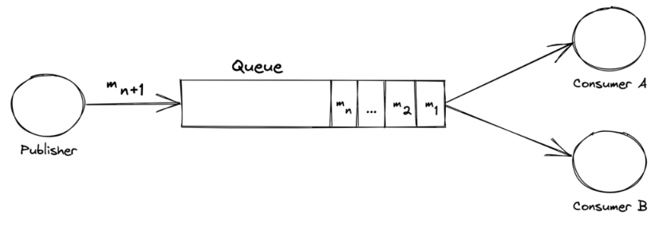
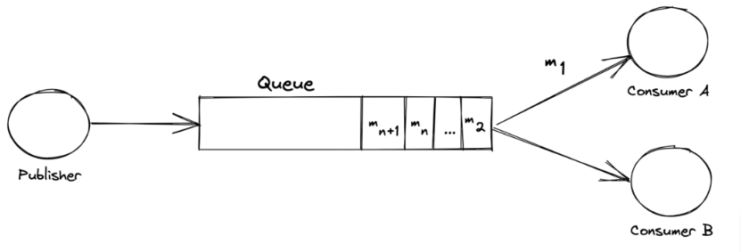
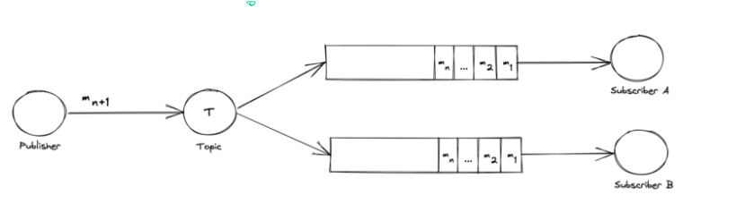
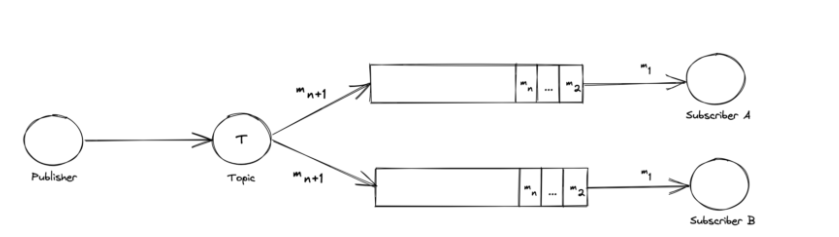

# Pub Sub vs Message Queue

## Message Queue
The queue pattern exists due to the problem of suffering from a single job per service, since you have several messages and for each one you want to perform a single specific job, so to ensure that the job is executed only once, the use of queues is required.
In the images below we can see that several messages are published in the queue and are placed at the end of it, at the beginning of it the first job that is registered in the queue consumes the message and the next one will consume the next message.
Message queues can support high consumption rates by adding multiple consumers for each topic, but only one consumer receives each message on the topic. Which consumer receives which message is determined by the implementation of the message queue.

## Pub Sub
Unlike queues, the publisher and subscribe pattern works in such a way that everyone who is written on the topic has access to receive each message, an analogy for this pattern is like a radio it works as a topic and once the publisher puts messages on it all those tuned in receive the message:

