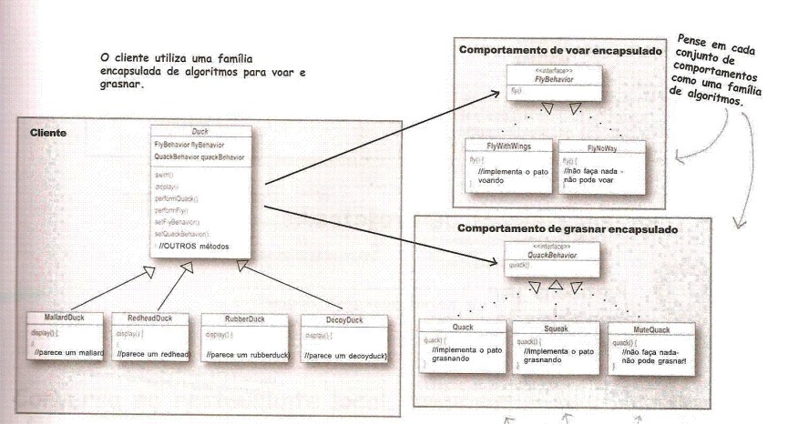

## The STRATEGY Pattern

Definition:
```
It defines a family of algorithms, encapsulates each one, and makes them interchangeable. The strategy lets the algorithm vary independently of the clients that use it.
```


A brief description with a case study:

Imagine that you are building an object that represents a bird, these types of animals have several characteristics, they fly, they sing, among others. Now adding more complexity to your problem, imagine that you want to build an application that creates all types of birds already cataloged, in a way that you don't have to go to every project if you have to make a modification and without having repetitive code.

A solution to this problem is to use the strategy pattern, with which you can break and abstract these characteristics of the birds, so that when creating a new object we have the possibility of instantiating a new characteristic that implements a larger interface that represents its feature into the new bird that implements another larger abstract class.


Diagram exemplifying:

